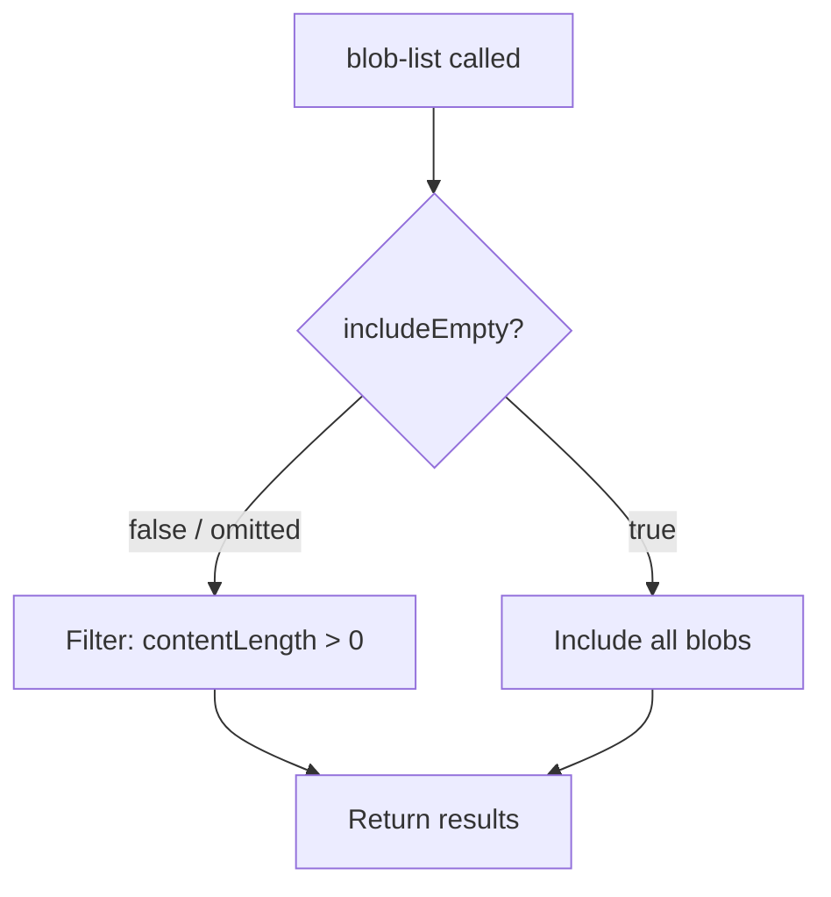
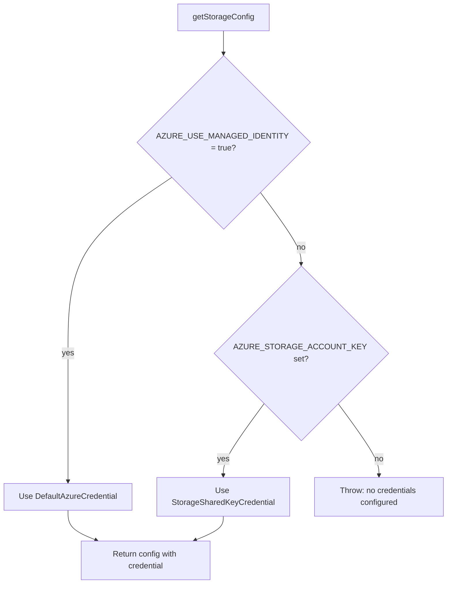
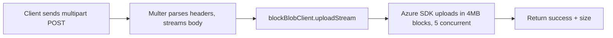
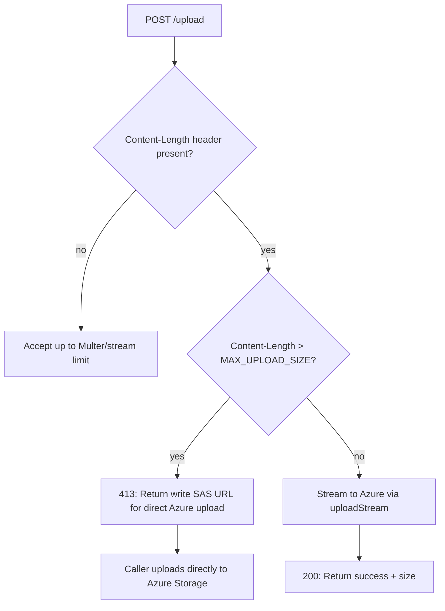

# Plan: #386 — Three Gaps in the Storage MCP Service

> **Source:** KD issue #386, 30 Sep 2026
> **Constraint:** No breaking changes to the existing MCP tool interface.

---

## Summary of Findings

After reviewing the codebase and probing the live deployment, here is what
each gap looks like from this repo's perspective and the proposed approach.

---

## Gap 1 — `blob-list` silently skips zero-byte blobs

**Priority:** low

### What the code does today

In [`blob-tools.ts`](src/tools/blob-tools.ts:191), the listing loop applies:

```ts
if (blob.properties.contentLength && blob.properties.contentLength > 0) {
```

This is a truthy check: `contentLength` of `0` is falsy in JavaScript, so
every zero-byte blob is excluded — empty source files, failed writes, and
legitimate zero-byte objects, not just directory-marker blobs.

### Proposed approach — optional parameter, backwards-compatible default

Add an `includeEmpty` boolean parameter to `blob-list`, defaulting to `false`
so existing callers see no change.



**Changes required:**

| File | Change |
|------|--------|
| [`src/tools/blob-tools.ts`](src/tools/blob-tools.ts:144) | Add `includeEmpty` param with `z.boolean().optional().default(false)`; branch the filter accordingly |
| [`src/tools/blob-tools.ts`](src/tools/blob-tools.ts:146) | Update tool description to mention the parameter |
| [`tests/tools/blob-tools.test.ts`](tests/tools/blob-tools.test.ts) | Add test cases: default excludes zero-byte blobs; `includeEmpty: true` includes them |
| [`tests/integration/blob-integration.test.ts`](tests/integration/blob-integration.test.ts) | Optional: add integration test that creates a zero-byte blob and lists with both modes |

**Risk:** None — additive parameter with the current behaviour as default.

---

## Gap 2 — No access-tier tool

**Priority:** low — no MCP tool needed, but lifecycle policy in Bicep is worth adding

The report explicitly states: *"This is not a gap we need closed"* as an MCP
tool. Lifecycle management policies are the better mechanism — they are
declarative, server-side, and free.

### Optional infrastructure enhancement — lifecycle policy in Bicep

Azure Storage lifecycle management policies **can be provisioned in Bicep** as
a child resource of the storage account. This would give newly-provisioned
storage accounts automatic tiering out of the box, without anyone needing to
configure it manually in the Portal.

Example policy that could be added to [`infra/main.bicep`](infra/main.bicep:178):

```bicep
resource lifecyclePolicy 'Microsoft.Storage/storageAccounts/managementPolicies@2023-05-01' = if (!useExistingStorage) {
  parent: storageAccount
  name: 'default'
  properties: {
    policy: {
      rules: [
        {
          name: 'cool-after-30-days'
          enabled: true
          type: 'Lifecycle'
          definition: {
            actions: {
              baseBlob: {
                tierToCool: { daysAfterModificationGreaterThan: 30 }
              }
            }
            filters: {
              blobTypes: [ 'blockBlob' ]
            }
          }
        }
        {
          name: 'archive-after-90-days'
          enabled: true
          type: 'Lifecycle'
          definition: {
            actions: {
              baseBlob: {
                tierToArchive: { daysAfterModificationGreaterThan: 90 }
              }
            }
            filters: {
              blobTypes: [ 'blockBlob' ]
              prefixMatch: [ 'backups/', 'archives/' ]
            }
          }
        }
      ]
    }
  }
}
```

**Key points:**

- Only applies to **newly-provisioned** storage accounts — not BYOSA, which
  the customer manages themselves.
- The `prefixMatch` filter on the archive rule means only blobs in known
  archival paths get archived; active data stays Hot or Cool.
- The thresholds — 30 days to Cool, 90 days to Archive — are sensible
  defaults. They could be parameterised in Bicep if different environments
  need different policies.
- This is **completely independent** of the MCP tool interface. No code
  changes in `src/` required.

**Changes required:**

| File | Change |
|------|--------|
| [`infra/main.bicep`](infra/main.bicep:178) | Add `lifecyclePolicy` resource as child of `storageAccount`, gated on `!useExistingStorage` |
| [`infra/main.parameters.json`](infra/main.parameters.json) | Optionally parameterise the day thresholds |

**Risk:** None — purely additive infrastructure. Does not affect BYOSA
deployments or the application code. Can be deployed independently.

Recorded so the next person does not go looking for a `blob-set-access-tier`
tool.

---

## Gap 3 — Authentication is a storage account shared key

**Priority:** medium — roadmap item, not a defect

### What the code does today

[`config.ts`](src/config.ts:55) reads `AZURE_STORAGE_ACCOUNT_KEY` from the
environment. Every SDK client — [`blob-tools.ts`](src/tools/blob-tools.ts:46),
[`utility-tools.ts`](src/tools/utility-tools.ts:27), the `/upload` handler in
[`server.ts`](src/server.ts:484) — constructs a `StorageSharedKeyCredential`
from that key.

### Infrastructure readiness

The Bicep template in [`infra/main.bicep`](infra/main.bicep:114) already
provisions a **user-assigned managed identity** and grants it:

- `Storage Blob Data Contributor` — line 195
- `Storage Queue Data Contributor` — line 205
- `Storage Table Data Contributor` — line 215

The `@azure/identity` package is already a dependency in
[`package.json`](package.json:41).

So the identity and the RBAC grants already exist; the application code simply
does not use them yet.

### Proposed approach — dual-mode auth with feature flag

Support both mechanisms. When a managed identity environment variable is set,
use `DefaultAzureCredential`; otherwise fall back to the shared key. This
keeps local dev, Azurite, and existing deployments working while letting a
regulated deployment switch to keyless auth by setting a single env var.



**Changes required:**

| File | Change |
|------|--------|
| [`src/config.ts`](src/config.ts) | Add `useManagedIdentity` flag; export a `getCredential` function that returns either `DefaultAzureCredential` or `StorageSharedKeyCredential` |
| [`src/tools/blob-tools.ts`](src/tools/blob-tools.ts:46) | Use `getCredential` instead of constructing `StorageSharedKeyCredential` directly |
| [`src/tools/utility-tools.ts`](src/tools/utility-tools.ts:27) | Same — use `getCredential` for SAS generation. Note: SAS generation **requires** a shared key, so SAS tools must check and throw a clear error if running in managed-identity-only mode |
| [`src/server.ts`](src/server.ts:484) | `/upload` handler: use `getCredential` |
| [`infra/main.bicep`](infra/main.bicep:322) | Add `AZURE_USE_MANAGED_IDENTITY` env var, conditionally omit the storage-account-key secret |
| `.env.example` | Document the new variable |
| `README.md` | Document managed identity configuration |
| Tests | Unit tests for both credential paths in config; mock `DefaultAzureCredential` |

**Constraints and caveats:**

- **SAS generation requires a shared key.** The `generateBlobSASQueryParameters` function in the Azure SDK needs a `StorageSharedKeyCredential`. In managed-identity mode, SAS tools — [`blob-get-sas-url`](src/tools/blob-tools.ts:357), [`blob-get-container-sas`](src/tools/blob-tools.ts:391), [`util-refresh-blob-sas`](src/tools/utility-tools.ts:94), [`util-refresh-container-sas`](src/tools/utility-tools.ts:143) — must either require the key as a fallback env var, use User Delegation SAS via `blobServiceClient.getUserDelegationKey`, or return a clear error. User Delegation SAS is the cleanest path.
- **Azurite does not support managed identity.** Local dev will always use the shared key path.
- **BYOSA mode** in Bicep currently passes the key directly. If an external account's RBAC were configured for the managed identity, BYOSA could also go keyless, but that is out of scope for this change.

**Risk:** Medium — touches the credential path used by every tool module. Gated behind a flag, so the default path is unchanged. Must be well-tested.

---

## Gap 4 — Large upload fails and takes the connection down

**Priority:** medium — this is a reliability defect

### What happens today

The `/upload` endpoint in [`server.ts`](src/server.ts:442) uses Multer with
`memoryStorage()` and a 100 MB limit. The entire file is buffered in RAM as a
`Buffer`, then uploaded to Azure via `blockBlobClient.uploadData`.

The calling service reports a 219.5 MB backup archive. The failure chain:

1. **Multipart upload to `/upload` fails** — either the 100 MB Multer limit
   rejects it, or the in-memory buffer exhausts the container's 1 GiB RAM
   allocation, from [`main.bicep`](infra/main.bicep:316).
2. **Fallback to MCP base64** — the caller encodes the file as base64 and
   sends it through `blob-create`. At 219.5 MB this exceeds the 50 MB JSON
   body limit set in [`server.ts`](src/server.ts:109), so it also fails.
3. **Connection goes down** — after the failed upload, the Azure Storage
   connection becomes unavailable with 503 errors until the process is
   restarted. This is likely caused by OOM pressure or an unhandled error
   leaving the HTTP pipeline in a broken state.

### Two sub-problems

**4a. No streaming upload path for large files**

Both upload mechanisms — `/upload` with Multer and `blob-create` via MCP —
buffer the entire file in memory. For files exceeding ~50–100 MB, neither
works on the current infrastructure.

**4b. Failed upload poisons the caller's connection — NOT this server's**

The report says the API returned 503 `STORAGE_UNAVAILABLE` after the failed
upload. On review, this is the **caller's** API, not this MCP server. The
caller's HTTP client — which connects to this MCP server — is what gets
poisoned after an oversized upload attempt, not the Azure SDK connection
inside this process. The MCP server itself likely returned an error correctly
— either Multer's 413 or an OOM crash — and the caller's client did not
recover from the broken connection.

**What this means for our scope:**

- This server should return **clean, fast errors** for oversized uploads so
  the caller's connection is not left hanging or half-closed.
- The 503 recovery problem is in the caller's codebase, not here.
- We should still fix 4a — a streaming upload path — because the 100 MB
  memory buffer is a real limitation. But the "connection goes down" symptom
  is not ours to fix.

### Proposed approach

#### 4a — Stream-based upload with Azure SDK `uploadStream`

Replace the in-memory buffering in `/upload` with Multer's no-storage mode
— where it pipes the file as a readable stream — and use the Azure Blob SDK's
`blockBlobClient.uploadStream` method, which handles chunking and parallelism
internally.



**Changes required:**

| File | Change |
|------|--------|
| [`src/server.ts`](src/server.ts:442) | Replace `multer.memoryStorage()` with a custom handler or `multer` stream mode. Switch from `uploadData` to `uploadStream`. Increase the size limit to 500 MB or make it configurable. Add a `Content-Length` pre-check that returns 413 early for files exceeding the limit. |
| [`src/server.ts`](src/server.ts:109) | Consider a separate body-size limit for the `/upload` route vs `/mcp` |

**Implementation option — Busboy directly instead of Multer:**

Multer's `memoryStorage` buffers; its `diskStorage` writes to a temp file,
which is better but still double-handles the data. A leaner approach is to
use Busboy, which Multer wraps, to parse the multipart stream and pipe it
directly into `uploadStream`. This avoids any intermediate buffering.

Alternatively, since Multer v2 supports streaming, we can access `req.file`
as a stream rather than a buffer by using a custom storage engine.

The simplest pragmatic approach: keep Multer for field parsing but switch
to `diskStorage` with a temp directory, then stream from the temp file into
`uploadStream`, deleting the temp file after. This is the lowest-risk change
while solving the memory issue.

#### 4b — Clean error responses and defensive hardening (our side)

The 503 `STORAGE_UNAVAILABLE` reported after the failed upload is on the
**caller's** API, not this MCP server. Their HTTP client's connection to
us got poisoned by the failed upload attempt — likely a half-closed
connection or an unread response body — and they did not recover from it.

**What we should do on our side:**

1. **Return fast, clean 413 errors** for oversized uploads so the caller's
   connection is properly closed and reusable.
2. **Fix the `/upload` handler** to use the singleton `BlobServiceClient`
   from a shared module instead of lazy-importing and creating a new one
   per request — currently at [`server.ts:480`](src/server.ts:480). This
   is a code-quality issue, not the cause of the 503.
3. **Add a size-gated SAS redirect**: if `Content-Length` exceeds a
   configurable threshold, return a 413 with a JSON body containing a
   pre-signed write SAS URL so the caller can upload directly to Azure,
   bypassing this server entirely.



**Changes required:**

| File | Change |
|------|--------|
| [`src/server.ts`](src/server.ts:442) | Add `Content-Length` pre-check middleware before Multer. Return 413 with SAS URL for files over the threshold. |
| [`src/server.ts`](src/server.ts:480) | Use the singleton `BlobServiceClient` pattern instead of lazy-importing per request. |
| [`src/server.ts`](src/server.ts:442) | Ensure error responses on `/upload` always close the connection cleanly — set `Connection: close` on error responses if needed. |

**What we should NOT do:**

- Attempt to fix the caller's 503 recovery — that is their client's
  responsibility.
- Add complex health-check or circuit-breaker logic to this server for a
  problem that is not here.

**Risk:** Low — the streaming change in 4a is the structural fix. This is
defensive hardening and better error responses.

---

## Not a Gap — Immutability policy behaviour

The report notes that `blob-delete` and overwrites will fail once
immutability policies are applied. This is expected Azure behaviour and does
not require code changes in this repo. The error messages from the Azure SDK
will surface through the existing error handling.

---

## Recommended Implementation Order

Each step includes unit tests alongside the code change — no code lands
without a test validating it.

1. **Gap 1** — `includeEmpty` param on `blob-list` + unit tests for both modes.
2. **Gap 2** — Lifecycle policy in Bicep. Infra-only, no code or test changes.
3. **Gap 4a** — Streaming upload + unit tests for the streaming path and the size-gated 413 response.
4. **Gap 4b** — Clean error responses / singleton client refactor + tests. Done alongside 4a.
5. **Gap 3** — Managed identity dual-mode auth + unit tests for both credential paths, SAS tools under managed identity, and config validation.

### Interface compatibility — Gap 4a does NOT break existing clients

The external contract of `POST /upload` is unchanged:

- Same method, same fields, same response schema, same auth header.
- The internal change is memory-buffered → streamed.
- The **new behaviour** — a 413 with a SAS URL for oversized files — is
  strictly better than the current failure mode, where large files either
  hit the 100 MB Multer wall or crash the process.
- Clients that succeed today will continue to succeed. Clients that fail
  today will get an actionable error with a direct-upload SAS URL.

---

## Files Changed Summary

| File | Gap 1 | Gap 2 | Gap 3 | Gap 4 |
|------|:-----:|:-----:|:-----:|:-----:|
| `src/tools/blob-tools.ts` | ✓ | | ✓ | |
| `src/config.ts` | | | ✓ | |
| `src/tools/utility-tools.ts` | | | ✓ | |
| `src/server.ts` | | | ✓ | ✓ |
| `infra/main.bicep` | | ✓ | ✓ | |
| `infra/main.parameters.json` | | ✓ | | |
| `.env.example` | | | ✓ | |
| `README.md` | | | ✓ | |
| `tests/tools/blob-tools.test.ts` | ✓ | | ✓ | |
| `tests/integration/blob-integration.test.ts` | ✓ | | | ✓ |
| `tests/tools/utility-tools.test.ts` | | | ✓ | |
